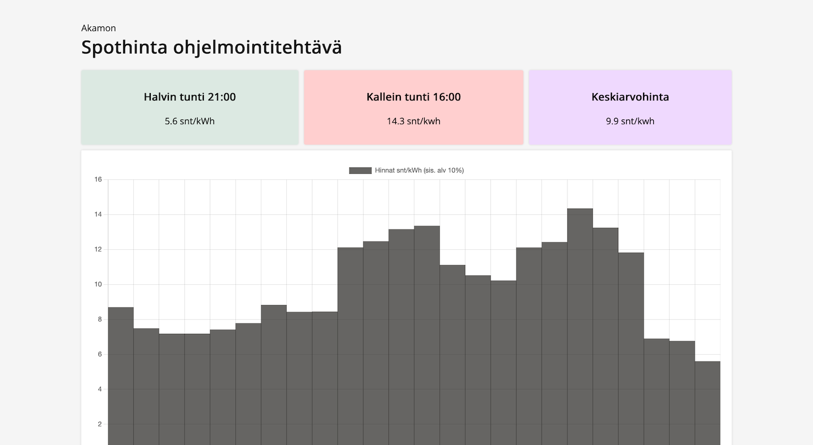
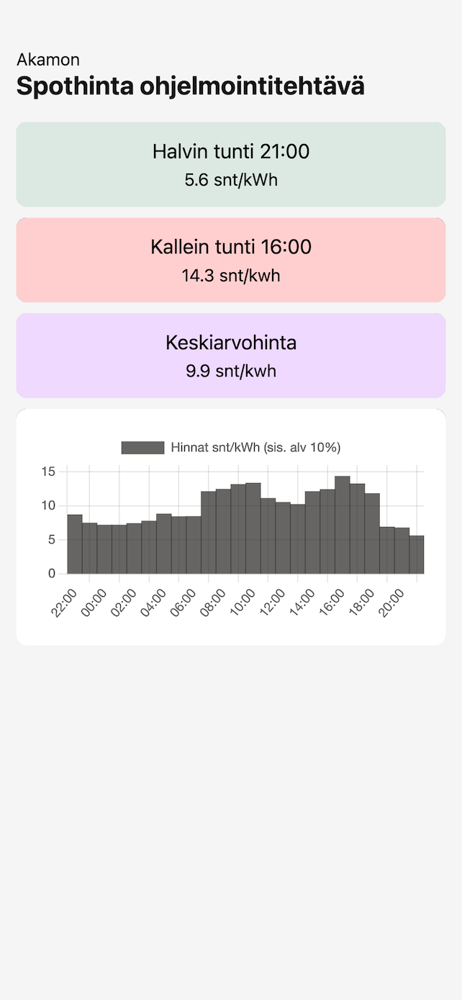

# Spothinta ohjelmointitehtävä

This project was bootstrapped with [Create React App](https://github.com/facebook/create-react-app).

## Sovelluksen ajaminen

Sovelluksen moduulit pitäisi latautua projektin juuressa komennolla ```npm install```. 

Json-serverin saa päälle komennolla ```npx json-server --port=3001 --watch data/spot-data.json```.

Tämän jälkeen sovelluksen voi käynnistää toisessa ikkunassa komennolla ```npm start```.

## Kuvaus

Aloitin luomalla sovelluksen yllämainitulla tavalla. Tarvittavien komponenttien luominen sujui ongelmitta, mutta toiminnallisuuksien tekemisissä oli tilanteesta riippuen pienempää tai isompaa punakynää. Ne kuitenkin ratkesivat dokumentaation lukemisella, googlaamalla ja konsolin suurella käytöllä. Harmaita hiuksia syntyi kaavion luomisessa, mitä en ollut koskaan tehnyt. Onneksi siinäkin Google auttoi nopeasti ja neuvoi Chart.js:n pariin.

Datan pyörittely ja välittäminen meinasi aluksi olla hieman tahmeaa, mutta tarpeeksi kun konsolissa seurasi sen reittejä ja käyttäytymistä, se alkoi luonnistumaan. Lopulta mitä simppelimpi, sen toimivampi.

TypeSript oli lopulta oikein mieluinen lisä tähän. Loin funktiot datan käsittelyyn. Omien funktioiden tekeminen oli mukavaa, koska pääsi myös hieman käyttämään omia oppeja. Tosin niistä tuskin aivan pommin varmoja tuli. Kaikkeen tähän meni arviolta yhteenlaskettuna työpäivän verran aikaa.

Lopulta käytin aikaa ulkoasuun, johon sai uppoamaan ehkä puolikkaan työpäivän verran aikaa. Koitin ottaa inspiraatiota netistä erilaisista "dashboard"-sivuista. Loin sovelluksesta responsiivisen. Sovelluksella on omat tyylinsä tietokoneelle, tabletille ja puhelimelle. Ainoa ongelma on kaavion kanssa, joka ei ikkunaa isontaessa pysy automaattisesti mukana. Tämä kuitenkin korjaantuu päivittämällä sivun.

Uskon että vielä testien tekemiseen olisi saanut lisää laitettua aikaa, jos niitä olisi alkanut tekemään. Jätin ne tosin tekemättä, sillä niitä ei erikseen vaadittu. Tiedän kuitenkin, että se on tärkeä osa oikeaa kehittämistä. Sen verran testasin, että sovellus ei ihan mene jumiin jos dataa ei saataisi.

edit. Lisäys: testittömyys jäi rassaamaan mieltä, joten lisäsin hieman testailua. Testit voi ajaa komennolla ```npm run test```.

## Kuvia



